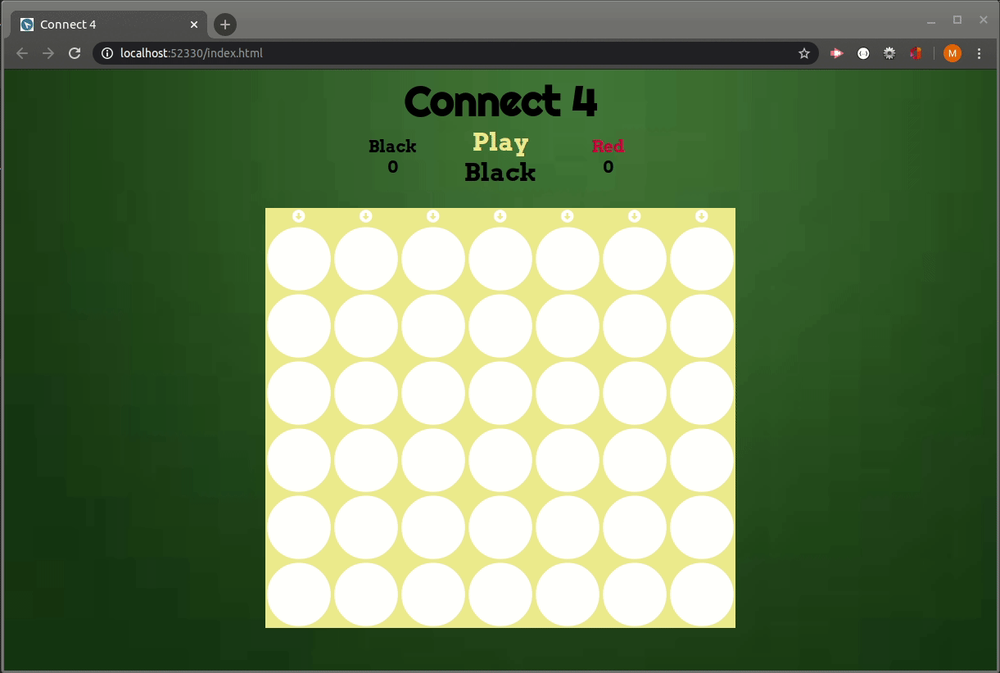

# Connect 4 Game
https://chindowns/github.io/connect-4

Connect Four (also known as Four Up, Plot Four, Find Four, Four in a Row, Four in a Line, Drop Four, and Gravitrips (in Soviet Union)) is a two-player connection board game in which the players first choose a color and then take turns dropping one colored disc from the top into a seven-column, six-row vertically suspended grid. The pieces fall straight down, occupying the lowest available space within the column. The objective of the game is to be the first to form a horizontal, vertical, or diagonal line of four of one's own discs. Connect Four is a solved game. The first player can always win by playing the right moves.



# Technology
* Javascript - ES6
* jQuery
* HTML5
* CSS3

# Code Snippet
This is refactored code that animated the disk drop

```
    function dropDisk(column, color) {
        let lowestRow = findLowestRow(column)

        // Animate disk drop with setInterval
        const setSpot = (row) => {
            $(`#${row}-${column}`).addClass(color);
        }

        const removeSpot = (row) => {
            $(`#${row}-${column}`).removeClass(color);
        }

        for (let row = 0; row <= lowestRow; row++) {
            setTimeout(function () {
                if (row > 0) {
                    removeSpot(row - 1);
                    setSpot(row);
                    // Disc at lowestRow, check if there is a winner
                } else { 
                    setSpot(row); 
                }

                if (row === lowestRow) {
                    board[lowestRow][column] = color;
                    checkWin(row, column);
                    // Set the first spot
                }

            }, (row * 250) - row);
        }

        // $(`#${lowestRow}-${column}`).addClass(color)
        // board[lowestRow][column] = color
        // nextMove()

    }
```
# Learning
Before even writing code, plan and pseudo code.  Get something on screen, make it work, then make it better.

# Authors
#### Michael Downs
   [GitHub](https://github.com/chindowns) Michael Downs 
[LinkedIn](http://www.linkedin.com/in/michaeldownssj)  

#### Ana Medrano
Co-authored the team build
   [GitHub](https://github.com/analoo) Ana Medrano  